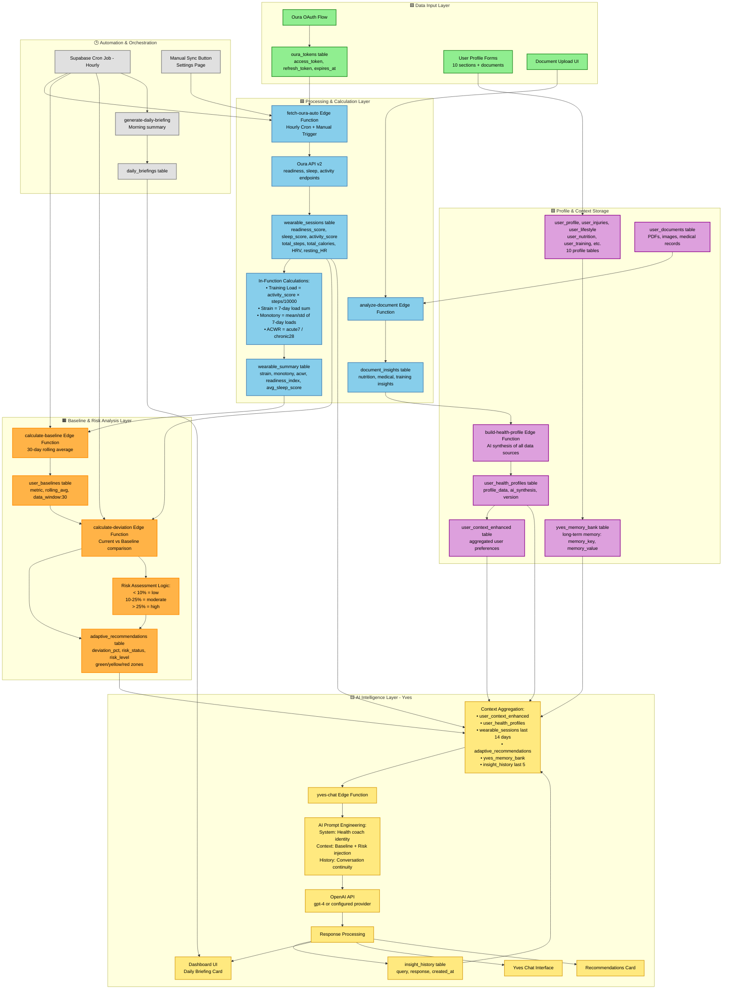

# Predictiv System Architecture

> Comprehensive documentation of the Predictiv health and wellness tracking platform's data pipeline, AI intelligence system, and component architecture.

---

## Table of Contents

1. [Overview](#overview)
2. [System Architecture Diagram](#system-architecture-diagram)
3. [Architecture Layers](#architecture-layers)
4. [Key Technologies](#key-technologies)
5. [Data Flow Summary](#data-flow-summary)
6. [Security & Privacy](#security--privacy)

---

## Overview

Predictiv is a health intelligence platform that integrates wearable device data (Oura Ring, Fitbit) with AI-powered coaching to provide personalized health insights, baseline tracking, and risk analysis.

**Core Capabilities:**
- Real-time wearable data synchronization
- Automated baseline calculation and deviation detection
- AI health coach ("Yves") with contextual awareness
- Document intelligence for medical records
- Comprehensive user profiling across 10 health dimensions
- Risk zone analysis (green/yellow/red)

**Tech Stack:**
- **Frontend:** React 18 + TypeScript + Vite
- **UI:** Shadcn/ui + Tailwind CSS (glassmorphism design)
- **Backend:** Supabase (PostgreSQL + Edge Functions)
- **AI:** OpenAI GPT-4 (configurable provider)
- **Auth:** Supabase Auth (email/password)

---

## System Architecture Diagram



---

## Architecture Layers

### 🟩 Input Layer

**Purpose:** Data entry points into the system

**Components:**
1. **Oura OAuth Flow** - User authenticates with Oura Ring account
2. **oura_tokens Table** - Stores OAuth credentials (access_token, refresh_token, expires_at)
3. **User Profile Forms** - 10-section comprehensive health profile (personal info, injuries, lifestyle, nutrition, training, medical, wellness goals, recovery, mindset, interests)
4. **Document Upload UI** - Medical records, training plans, nutrition reports

**Key Features:**
- Automatic token refresh handling
- Multi-device support (Oura + Fitbit)
- Secure credential storage with RLS
- Real-time profile synchronization to Yves memory

---

### 🟦 Processing & Calculation Layer

**Purpose:** Transform raw wearable data into actionable metrics

**Data Pipeline:**

1. **fetch-oura-auto Edge Function**
   - Triggered: Hourly cron + manual sync
   - Fetches last 14 days from Oura API v2
   - Endpoints: `/daily_readiness`, `/daily_sleep`, `/daily_activity`

2. **wearable_sessions Table**
   - Stores: readiness_score, sleep_score, activity_score, total_steps, total_calories, HRV, resting_HR
   - Primary key: (user_id, source, date)
   - Upsert strategy prevents duplicates

3. **In-Function Calculations**
   - **Training Load:** `activity_score × (steps / 10000)`
   - **Strain:** Sum of training load over last 7 days
   - **Monotony:** `mean / std` of last 7 days' loads
   - **ACWR:** `acute_load (7-day avg) / chronic_load (28-day avg)`

4. **wearable_summary Table**
   - Stores calculated metrics: strain, monotony, acwr, readiness_index, avg_sleep_score
   - Updated automatically after each sync
   - Used for trend analysis and baselines

5. **Document Processing**
   - **analyze-document** Edge Function extracts structured data
   - AI-powered parsing of medical records
   - Stores in `document_insights` (nutrition, medical, training categories)

---

### 🟧 Baseline & Risk Analysis Layer

**Purpose:** Establish personal norms and detect concerning deviations

**Workflow:**

1. **calculate-baseline Edge Function**
   - Runs: Hourly (recommended)
   - Analyzes: Last 30 days of `fitbit_trends` data
   - Calculates: Rolling average for 8 metrics (HRV, ACWR, EWMA, Strain, Monotony, Training Load, Acute Load, Chronic Load)
   - Stores: `user_baselines` table with `data_window: 30`

2. **calculate-deviation Edge Function**
   - Compares: Most recent 7 days vs. baseline
   - Calculates: `deviation_pct = ((current - baseline) / baseline) × 100`
   - Integrates: Health profile for context-aware risk assessment

3. **Risk Zone Assignment**
   - **Green (Low Risk):** < 10% deviation
   - **Yellow (Moderate Risk):** 10-25% deviation
   - **Red (High Risk):** > 25% deviation

4. **adaptive_recommendations Table**
   - Stores: metric, deviation_pct, risk_status, risk_level, adaptive_suggestion
   - Used by Yves AI for prioritized coaching

**Context-Aware Risk Adjustments:**
- Training phase (base vs. peak) affects thresholds
- Medical conditions modify acceptable ranges
- Recovery periods allow higher deviations

---

### 🟪 Profile & Context Storage Layer

**Purpose:** Centralize user health intelligence for AI context

**Profile Tables (10 sections):**
1. `user_profile` - Personal info (name, DOB, gender, activity_level)
2. `user_injuries` - Injury history + details
3. `user_lifestyle` - Daily routine, work schedule, stress level
4. `user_interests` - Hobbies, interests
5. `user_nutrition` - Diet type, allergies, eating patterns
6. `user_training` - Preferred activities, frequency, intensity
7. `user_medical` - Conditions, medications, notes
8. `user_wellness_goals` - Goals, target dates, priorities
9. `user_recovery` - Sleep hours, quality, recovery methods
10. `user_mindset` - Motivation factors, mental health focus, stress management

**Synthesis Pipeline:**

1. **build-health-profile Edge Function**
   - Aggregates: Document insights + profile tables
   - AI Synthesis: Creates human-readable health summary
   - Versioning: Incremental versions for history tracking
   - Output: `user_health_profiles` table

2. **user_context_enhanced Table**
   - Aggregated preferences and high-level summary
   - Fast access for Yves AI context

3. **yves_memory_bank Table**
   - Long-term memory storage
   - Key-value pairs (e.g., `sleep_goal_hours: 8`, `training_focus: marathon`)
   - Updated when profile sections are saved

---

### 🟨 AI Intelligence Layer - Yves

**Purpose:** Provide personalized, context-aware health coaching

**Context Aggregation Sources:**
1. `user_context_enhanced` - User preferences
2. `user_health_profiles` - AI-synthesized health intelligence
3. `wearable_sessions` - Last 14 days of metrics
4. `adaptive_recommendations` - Current risk zones
5. `yves_memory_bank` - Long-term memory
6. `insight_history` - Last 5 conversations for continuity

**AI Prompt Structure:**

```
SYSTEM PROMPT:
You are Yves, an AI health coach specialized in endurance training, recovery, and injury prevention.

BASELINE & RISK ANALYSIS:
HRV: Current 45ms vs Baseline 52ms (-13.5% deviation) – Risk Zone: yellow
ACWR: Current 1.4 vs Baseline 1.1 (+27% deviation) – Risk Zone: red
...

USER CONTEXT:
Goals: Marathon in 6 months, improve sleep quality
Training Phase: Base building
Recent Injuries: Left knee strain (2023-11)
...

CONVERSATION HISTORY:
[Last 5 exchanges for continuity]

USER QUERY:
{user's question}
```

**Response Processing:**
1. OpenAI generates contextual response
2. Stored in `insight_history`
3. Displayed in Dashboard, Chat UI, Recommendations Card
4. Memory bank updated if preferences mentioned

**AI-Powered Features:**
- Daily Briefing (morning summary)
- Yves Chat (conversational interface)
- Recommendations Card (proactive suggestions)
- Insights Tree (visual timeline of advice)

---

### 🕒 Automation & Orchestration

**Cron Jobs (Supabase):**

```sql
-- Hourly sync recommendation
CRON: 0 * * * *
1. fetch-oura-auto → Sync wearable data
2. calculate-baseline → Update rolling averages
3. calculate-deviation → Detect new risk zones
4. generate-daily-briefing → Morning summary (6 AM only)
```

**Manual Triggers:**
- Settings Page → "Sync Now" button
- Fitbit/Oura Sync Page → Manual refresh
- Developer Tools → Function testing

**Automation Benefits:**
- Always-fresh data for users
- Proactive risk detection
- Reduced manual intervention
- Consistent baseline updates

---

## Key Technologies

### Frontend Stack
- **React 18** - UI framework
- **TypeScript** - Type safety
- **Vite** - Build tool
- **Shadcn/ui** - Component library
- **Tailwind CSS** - Styling (glassmorphism theme)
- **React Query** - Server state management
- **React Router** - Navigation

### Backend Stack
- **Supabase** - Backend platform
  - PostgreSQL database
  - Edge Functions (Deno runtime)
  - Row Level Security (RLS)
  - Realtime subscriptions
  - Cron jobs
- **OpenAI API** - AI intelligence
- **Oura API v2** - Wearable data

### Development Tools
- **ESLint** - Code linting
- **Prettier** - Code formatting
- **Lovable** - Development platform

---

## Data Flow Summary

### Typical User Journey

1. **Onboarding**
   - User registers (email/password)
   - Connects Oura Ring (OAuth)
   - Completes 10-section profile
   - Uploads medical documents

2. **Data Sync (Automatic)**
   - Hourly: `fetch-oura-auto` pulls last 14 days
   - Calculations: ACWR, Strain, Monotony computed
   - Storage: `wearable_sessions` + `wearable_summary`

3. **Baseline Establishment**
   - After 30 days: Personal baselines calculated
   - Risk zones: Deviation detection activated
   - AI context: Yves gains full user understanding

4. **Daily Usage**
   - Morning: Daily Briefing generated
   - Dashboard: Live metrics display
   - Chat: Ask Yves questions
   - Insights: Review recommendations

5. **Continuous Improvement**
   - Baselines: Updated hourly with new data
   - Profile: User updates sections as needed
   - Memory: Yves learns preferences over time

### Critical Data Paths

**Wearable → Dashboard:**
```
Oura API → fetch-oura-auto → wearable_sessions → Dashboard UI (< 5 min)
```

**Risk Detection:**
```
wearable_summary → calculate-baseline → user_baselines → calculate-deviation → adaptive_recommendations → Yves AI Context
```

**AI Coaching:**
```
User Query → yves-chat → Context Aggregation (6 sources) → OpenAI → insight_history → UI Display
```

---

## Security & Privacy

### Authentication
- Supabase Auth (JWT tokens)
- Row Level Security (RLS) on all tables
- Policy: Users can only access their own data

### Data Protection
- OAuth tokens encrypted at rest
- HIPAA-compliant data handling
- No third-party data sharing
- Service role key never exposed to client

### RLS Policy Example
```sql
CREATE POLICY "Users can view own sessions"
  ON wearable_sessions FOR SELECT
  TO authenticated
  USING (auth.uid() = user_id);
```

### Edge Function Security
- Service role key for admin operations
- User authentication required for personal data
- CORS headers properly configured
- Error messages sanitized (no sensitive data leaks)

---

## Performance Considerations

### Database Optimizations
- Indexes on frequently queried columns (user_id, date)
- Upsert strategies prevent duplicate data
- REPLICA IDENTITY FULL on trend tables for realtime
- Connection pooling via Supabase

### Frontend Optimizations
- React Query caching (5-minute stale time)
- Lazy loading for non-critical components
- Image optimization (WebP format)
- Code splitting by route

### Edge Function Best Practices
- Batch database operations
- Parallel API calls where possible
- Timeout handling (2-minute max)
- Comprehensive error logging

---

## Monitoring & Logging

### Function Execution Logs
- `function_execution_log` table tracks all Edge Functions
- Captures: function_name, status, duration_ms, error_message
- Retention: 30 days

### Wearable Sync Logs
- `oura_logs` table tracks sync operations
- Status: success, error
- Entries synced count
- Error details for debugging

### AI Conversation History
- `insight_history` table stores all Yves interactions
- Enables: Conversation continuity, usage analytics, quality improvement

---

## Future Enhancements

### Planned Features
- Multi-wearable support (Garmin, Whoop, Apple Watch)
- Team coaching for group training
- Advanced analytics dashboard
- Export to PDF/CSV
- Mobile app (React Native)
- Real-time alerts via SMS/push notifications

### AI Improvements
- Fine-tuned model on endurance training data
- Voice interface for Yves
- Predictive injury risk modeling
- Personalized training plan generation

---

## Related Documentation

- [DATA_FLOW.md](./DATA_FLOW.md) - Detailed metric calculation journeys
- [EDGE_FUNCTIONS.md](./EDGE_FUNCTIONS.md) - Complete function reference
- [DATABASE_SCHEMA.md](./DATABASE_SCHEMA.md) - Table schemas and relationships
- [README.md](./README.md) - Getting started guide

---

**Last Updated:** 2025-11-02
**Version:** 1.0.0
**Maintainer:** Predictiv Development Team
